#Dokumentáció

#Listamanager videojátékokhoz

Készítette: Polacsek Attila

##1. Követelményanalízis

###1.1. Célkitűzés, projektindító dokumentum

A program legfőbb célja, hogy olyan alkalmazást nyújtson, amelynek segítségével nyilván tarthatjuk, hogy mely játékokkal szeretnénk játszani, illetve mely játékokat vittük már végig. A játékokat egy nagy játékadatbázisból választhatjuk ki, a kiválasztott játékhoz megadhatjuk, hogy mennyire szeretnénk vele játszani, a játékokat kijátszás után értékelhetjük, illetve a játékokhoz bármikor írhatunk kommenteket. Az adatok védelme érdekében legyen lehetőség regisztrációra, majd bejelentkezésre. Bejelentkezett felhasználó a kijátszani szánt játékok listáját megtekintheti, bővítheti, meglévő elemeket törölhet, valamit megjegyzéseket írhat.

#####Funkcionális követelmények:
- Regisztráció
- Bejelentkezés
- Játéklista megtekintése
- Csak bejelentkezett felhasználók által elérhető funkciók:
 * új játék felvétele az érdekelt / végigvitt játékok listájába
 * meglévő játék törlése az érdekelt / végigvitt játékok listájáról
 * érdekelt játékok érdekeltségi fokozatának megváltoztatása
 *	komment írása, illetve törlése

#####Nem funkcionális követelmények:
-	Felhasználóbarát, ergonomikus elrendezés és kinézet.
-	Gyors működés.
-	Biztonságos működés: jelszavak tárolása, funkciókhoz való hozzáférés.

###1.2. Szakterületi fogalomjegyzék
**Videojáték:** olyan játék, amellyel a játékos egy felhasználói felületen keresztül lép kölcsönhatásba (interakcióba) és arról egy kijelző eszközön keresztül kap visszajelzéseket.

###1.3. Szerepkörök
-	**vendég**: videojátékok keresését, böngészését és megtekintését végezheti. Illetve regisztrálhat az oldalra.
-	**felhasználó**: a vendég szerepkörén túl a saját érdekelt játékok kezelésére (új, módosít, törlés) képes.

###1.4. Használati esetek

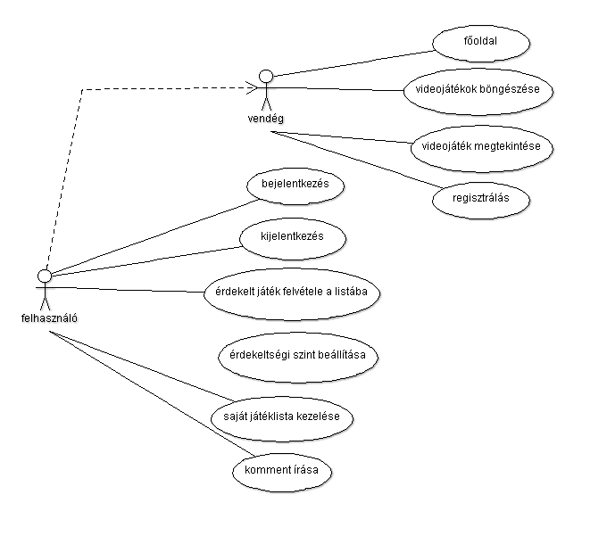
 
###1.5. Folyamatok meghatározás
 
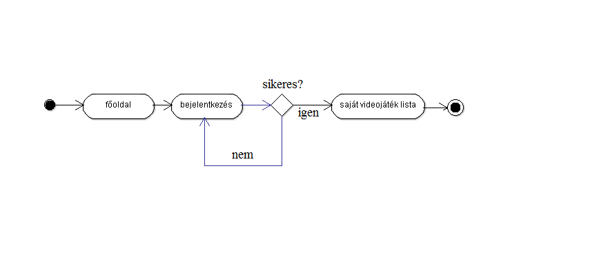

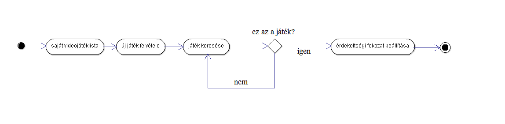

###1.6. Oldaltérkép
#####Publikus:
-	Főoldal
-	Videojátékok böngészése
-	Bejelentkezés
-	Regisztráció
#####Felhasználó:
-	Kilépés
-	Új videojáték felvétele
-	Listaoldal 
 *	Videojáték törlése
 *	Videojáték érdekeltségi fokozatának beállítása
 *	Videojáték áttétele a kijátszottak közé
-	Videojáték adatlapja
 *	komment írása
 
###1.7. Végpontok
-	GET/: főoldal
-	GET/login: bejelentkező oldal
-	POST/login: bejelentkező adatok felküldése
-	GET/login/signup: regisztrációs oldal
-	POST/login/signup: regisztrációs adatok felküldése
-	GET/logout: kijelentkező oldal
-	GET/videogames/list: videojátéklista oldal
-	GET/ videogames /new: új videojáték felvétele
-	POST/ videogames /new: új videojáték felvételéhez szükséges adatok felküldése
-	GET/ videogames /id: videojáték adatok
-	GET/ videogames /delete=id: videojáték törlése a listából
-	POST/ videogames /edit=id: érdekeltségi fokozat módosítása
-	POST/comments/id: új hozzászólás felvitele
-	GET/ comments /delete=id: hozzászólás törlése
-	GET/ comments /edit=id: hozzászólás módosítása
-	POST/ comments /edit=id: hozzászólás módosítása, adatok felküldése

###1.8. Oldalvázlatok

#####Főoldal
 
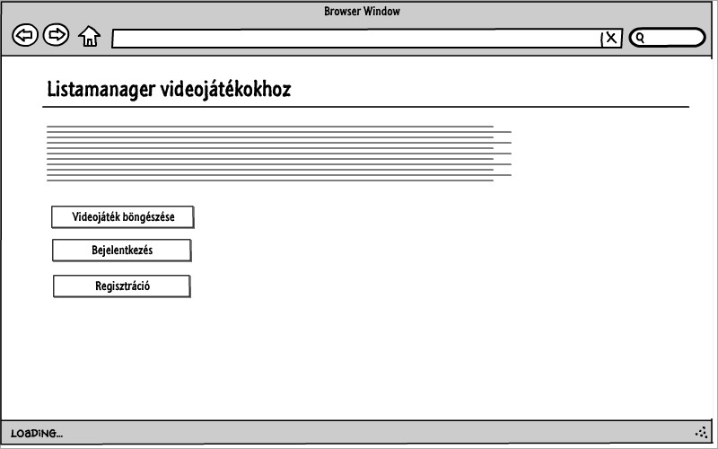
 
#####Regisztrációs oldal

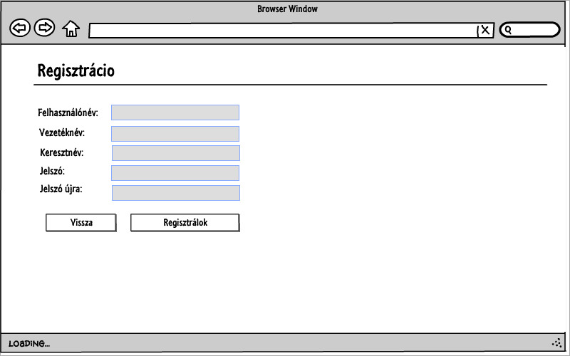

#####Bejelentkező oldal

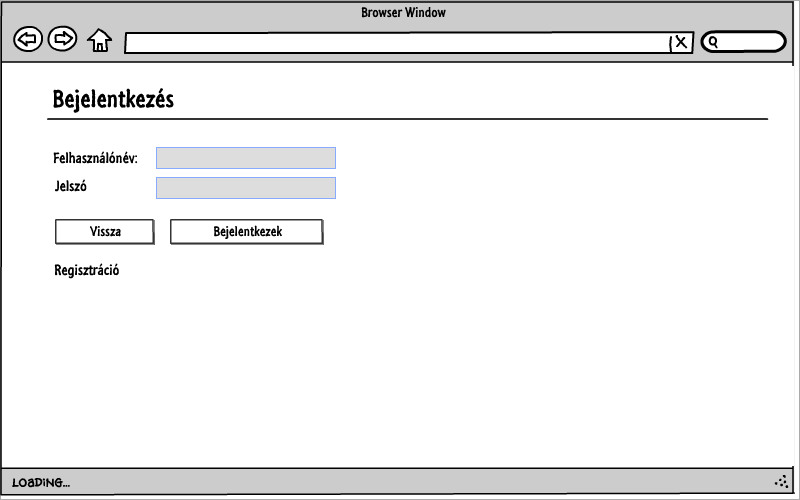

#####Videojáték listaoldal

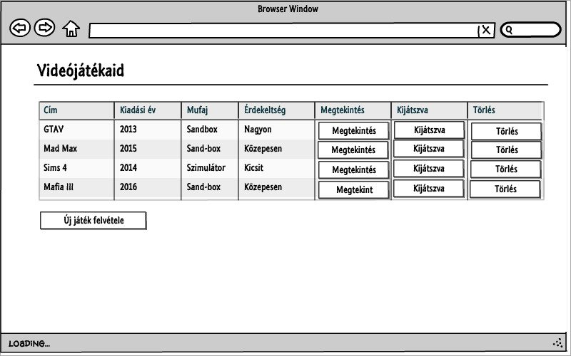

#####Új játék felvétele

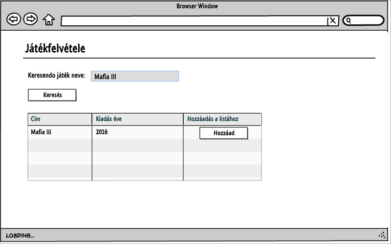

#####Videojáték megtekintése

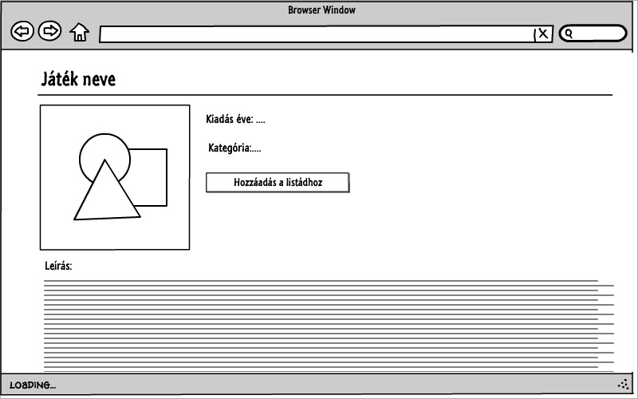

###1.9. Adatmodell

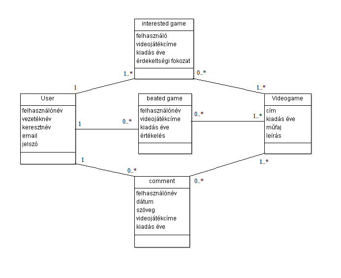

###1.10. Adatbázisterv

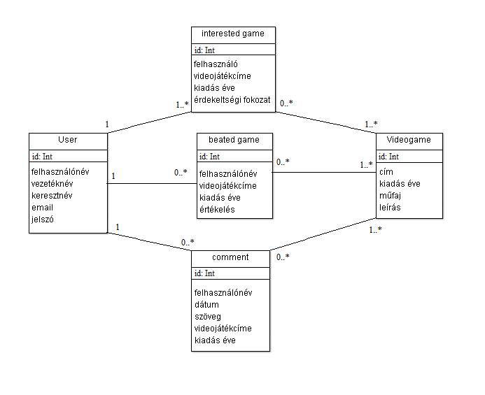
 
